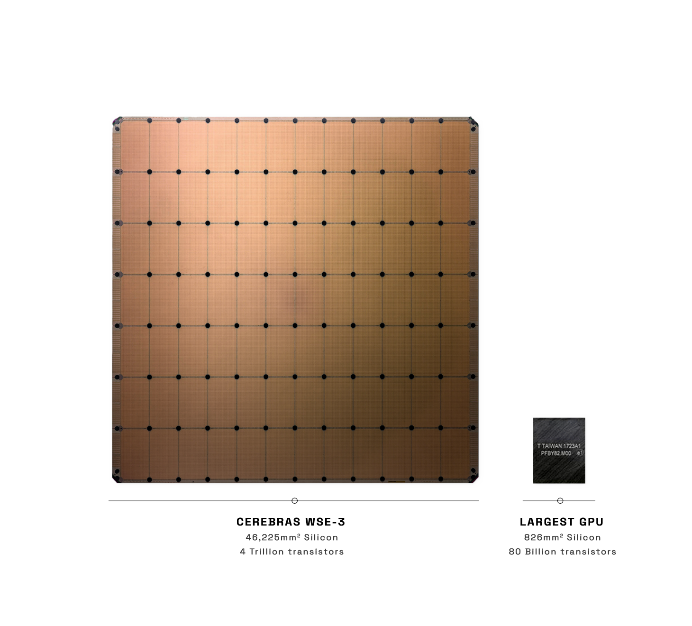
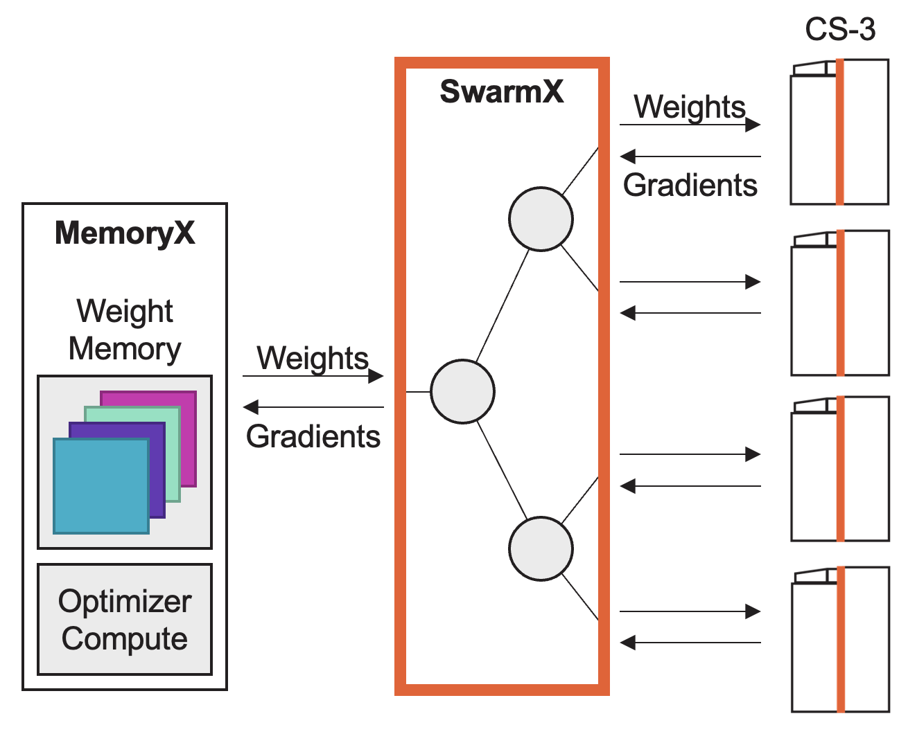

# Hands-on With Cerebras Systems 

The Cerebras CS system is designed from the ground up to accelerate the world's largest and most
challening AI workloads.

## The Wafer-Scale Engine

At the heart of the system is the Wafer-Scale Engine (WSE), a dinner-plate-sized chip. The WSE-3,
the third generation chip, packs 900,000 AI cores onto a single processor. Each core on the WSE is
independently programmable and optimized for the tensor-based, sparse linear algebra operations
that underpin neural network training and inference for deep learning, enabling it to deliver
maximum performance, efficiency, and flexibility.

Unlike traditional devices, in which the working cache memory is tiny, the WSE-3 takes 44GB of
super-fast on-chip SRAM and spreads it evenly across the entire surface of the chip. This gives
every core single-clock-cycle access to fast memory at extremely high bandwidth – 25 PB/s. This is
880x more capacity and 7,000x greater bandwidth than the leading GPU.

The 900,000 cores are laid out in a uniform grid, with each core connected to its four nearest
neighbors. The WSE-3 on-wafer interconnect eliminates the communication slowdown and inefficiencies
of connecting hundreds of small devices via wires and cables. It delivers an incredible 245 Pb/s
processor-processor interconnect bandwidth. That’s more than 3,715x the bandwidth delivered between
graphics processors.

## The Wafer-Scale Cluster

Each WSE is housed within a CS system, which provides 1.2 Tbps I/O to and from the chip. Argonne
has four CS systems with the third generation WSE-3 chip, networked together as a Wafer-Scale
Cluster (WSC). The WSC is our purpose-built cluster for training large AI models, though it can
also be used for inference applications, HPC, and beyond.

The WSC makes AI training workloads scale linearly across multiple CS systems, using a mode of
operation known as weight streaming, in which activations stay present on wafer and weights are
streamed one layer at a time to the CS systems. In addition to the CS systems, the WSC consists of
CPU nodes known as SwarmX and MemoryX. The MemoryX servers are responsible for holding the layer
weights and performing weight updates after receiving computed gradients. SwarmX is responsible for
broadcasting weights from the MemoryX to the CS systems, and reducing computed gradients from the
CS systems to the MemoryX. This topology enables a completely data parallel mode of training.

## Cerebras System Applications

The materials here focus on three applications for the Cerebras system: (1) push-button AI training
via PyTorch, (2) inference via the Cerebras inference API and Cerebras inference cloud, and custom
applications and HPC workloads developed with the low-level Cerebras SDK.

See the following sections to learn more:

1. [Getting started with AI training on Cerebras systems at the ALCF AI testbed](training/README.MD)
2. [Getting started with the Cerebras inference cloud](inference/README.MD)
3. [Getting started with the Cerebras SDK and simulator](sdk/README.MD)
